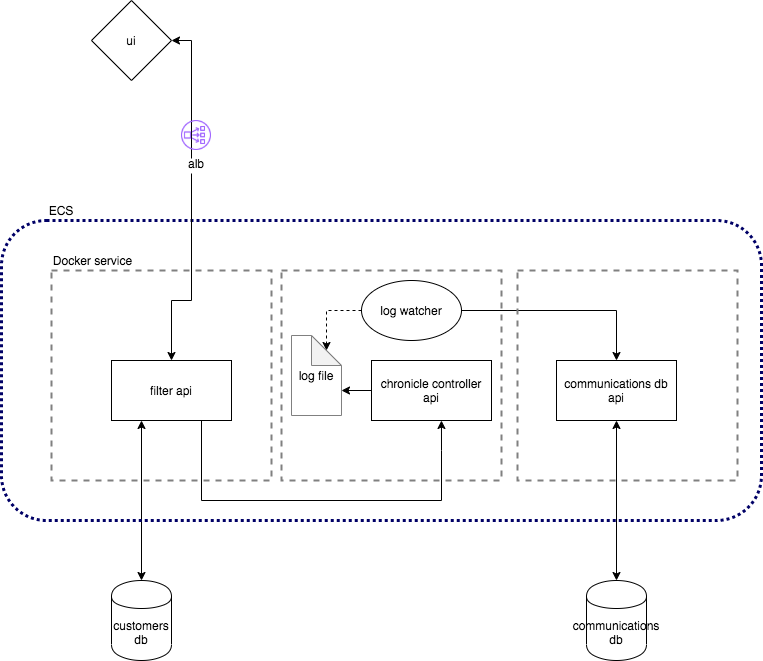

## Ideal Architecture


## Start-up

```
docker pull xy4kj/chronicle:latest
docker run --env EMAIL_PASSWORD=${EMAIL_PW} -p 80:80 xy4kj/chronicle:latest

docker pull xy4kj/communications-db-api:latest
docker run --env DB_PASSWORD=${DB_PW} -p 80:80 xy4kj/communications-db-api:latest
```